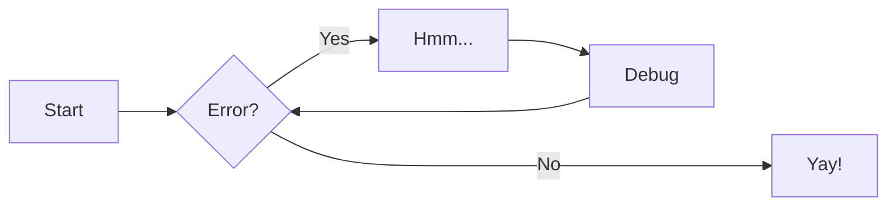
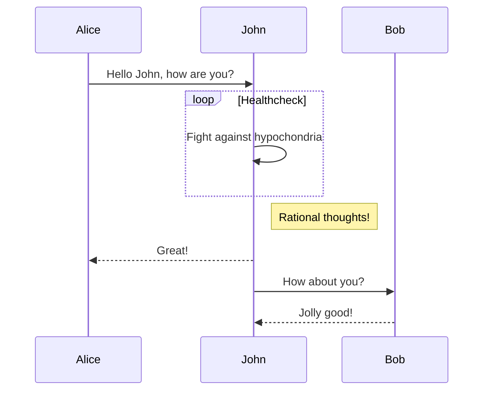

<!--
 ~ SPDX-FileCopyrightText: Copyright DB Netz AG and contributors
 ~ SPDX-License-Identifier: Apache-2.0
 -->

# This is demonstration page of MkDocs features


## Admonitions

!!! info

    Example info.

!!! warning

    Example warning

## Mermaid





## Footnote

Example footnote reference[^1]

[^1]: This is the footnote

## References

In order to get MkDocs to create anchors for all headings the following
configuration is needed:

``` md title="mkdocs.yml"
markdown_extensions:
  - toc:
      permalink: "🔗"
```

The permalink symbol is free to choose.

### Link to heading from same page

2 sections before you can learn about using [Mermaid](#mermaid) in MkDocs
documentation. From:

``` md
2 sections before you can learn about using [Mermaid](#mermaid) in MkDocs
documentation.
```

### Link to heading from any other page

See [SA-001](/modeling_rules/system_analysis#sa-001) for language rules.
From:

``` md
See [SA-001](/modeling_rules/system_analysis#sa-001) for language rules.
```

Using a relative link to the markdown file where your heading is.

## Image


