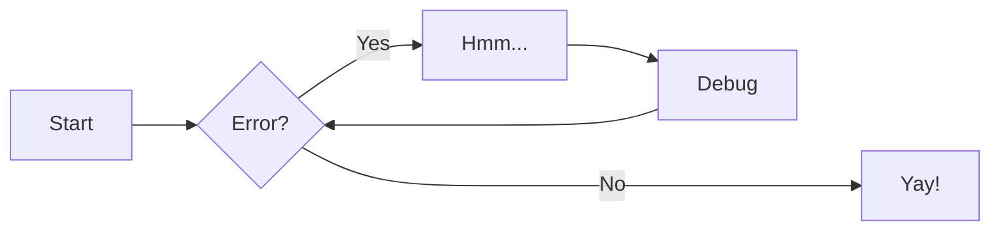
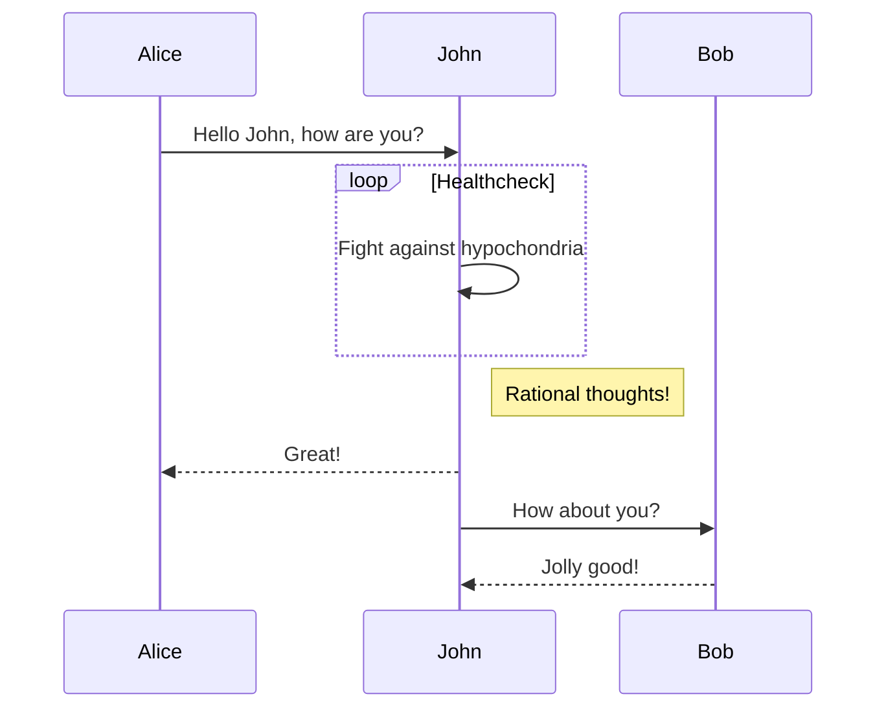

<!--
 ~ SPDX-FileCopyrightText: Copyright DB Netz AG and contributors
 ~ SPDX-License-Identifier: Apache-2.0
 -->

# This is demonstration page of MkDocs features

## Admonitions

!!! info

    Example info.

!!! warning

    Example warning

## Mermaid

## Footnote

Example footnote reference[^1]

[^1]: This is the footnote

## Image

