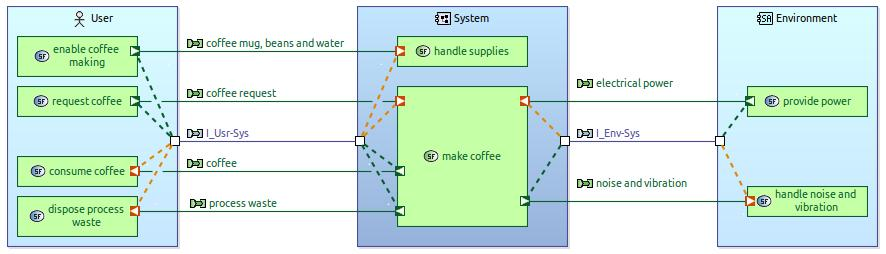

# Introduction

This method builds on top of ARCADIA methodology but selects very specific content creation paths that allow projects do more with less. For sure corner-cutting comes at a cost - but this cost may be acceptable in many cases. You may consider this approach as a way to deliver an MVP / PoC where a small engineering team needs to handle a complex problem in short time. The gaps you create by skipping certain analysis step can be filled later in most cases.

!!! warning

    This page is work in progress

!!! warning 

    Only apply this method if you understand the related risks

# System Analysis

For this tutorial, we will start this `System Analysis` and skip Operational Analysis. If you do have time to perform operational analysis upfront, it will give you a better understanding of ....

1. **capture business need** - somebody wants to make things happen. We need to have a good understanding of what outcomes are expected.
2. **identify system capabilities** -  based on the business objectives we should identify what capabilities the `System` will bring in, what stakeholders would receive value out of the system capability and what other stakeholders must or may be involved to create that value. We would perform that analysis only for one capability at a time and perform consolidation later. We may however consider doing this on a number of capabilities but only if those are closely linked and form the Minimum Viable Product scope together. In ARCADIA terms we may use mission to bundle such capability collection.
   
   

3. **identify functions and responsibilities** - for a selected capability we should identify what the system and involved stakeholders should do together to create and deliver the value. There are many ways to go about it in the tool. A good way to discover the functions is to analyse a scenario of how the stakeholders will interact with the system. 
    Ideally this is done solution-agnostic. Ideally we stay solution-agnostic / unbiased and focus on the stakeholder and system needs. But good enough frequently beats ideal on the time axis.

    
   
    There also may be many ways for how an interaction may go as well as sunny / rainy day scenarios.
   
4. **refine problem understanding** - you may add details such as description of data structures, system and stakeholder states. However you may also skip it.
   
    

    
    You may find more reasoning and decision-making hints in the corresponding section.

    More system definition details can get extracted when functions of the system or actor responsibilities are linked to corresponding  states. You may find more reasoning for that in [System States Analysis](#TODO) section.
5. **define system interfaces** - in this step we would bundle the functional exchanges / interactions between the system and actors into interfaces / component exchanges.
   
   
   
6. **consolidate outcomes** - the idea is to perform analysis of "one capability at a time" - and that analysis may happen in a sequence or in parallel. Either way, at certain point the `System` will contain functions and interface stakeholders (`Actors`) that are related to other capabilities that were either analysed before or brought in by other teams / team members. We will align those in this process step - remove duplications, consolidate definitions and interfaces.
7. **release system analysis results** - Systems Engineering is a team sport. Regardless of domain, if you are applying MBSE to a problem / project - there must be enough complexity to involve multiple disciplines. And not all disciplines involved should understand what MBSE is about, but they should understand what the `System`under consideration is about and agree to the definition and problem understanding that comes out of the analysis. A way to achieve such agreement / "buy-in" is to let all the project stakeholders to review / comment on the outcome of system analysis activity. And to avoid huge surprises such review should be conducted frequently. To keep the pace we would also propose a pragmatic approach to review - the SE team publish consolidated "release-candidate" of system definition, stakeholders review it and raise comments. The comments get addressed on the consolidated version. When the team is happy with the state of comments (valid comments are implemented or planned for next releases, invalid comments are dismissed and justification accepted) - the team may release the system definition and baseline the model / derived documents.

# Requirements for tooling landscape

To apply this approach you will need some basic tools in place:

* A tool to capture and track discussions related to business needs understanding. Anything with basic version control means will fit - you may go for professional Requirements Management (RM) solution but you can also get through it with something like Confluence / Jira or even a markdown file in a git repository.
* A tool to apply this method - Capella, ideally. But for sure you could do this with any SysML / UML tool if you have time and will to define a profile extension and do extra clicks (SysML 1.x for instance may want you to multiple model elements for description of system functions or actor responsibilities from structural or behavioural perspectives - with Capella it is a bit more straight-forward)
* A solution for co-working on architectures - in many cases you can get away with a git repository management solution such as Gitlab / Github / Bitbucket, but depending on the scale and scope you may also want to consider TeamForCapella or Capella-collab-manager