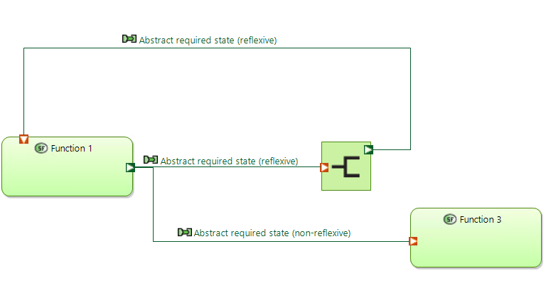

# Modeling Rules for System Analysis

## Overall

### SA-001
In order to ensure consistency within the project, British English is to be used at all times.

Refer to the [Cambridge Dictionary](https://dictionary.cambridge.org/) for further information.

### SA-002	
Images and/or diagrams that are to be used in the descriptions of Capella model elements shall be created and maintained.

### SA-003
Description Links for model elements shall be used in all model element descriptions.

E.g. if a certain description refers to a defined model element, the name of the model element being referred to shall be copied (as a Description Link) and pasted (as a Link) in the corresponding description field.

Exception: model elements defined as abstract concepts or terms, which serve solely as a form of documenting information external to the project, shall be excluded from this rule.

## Elements
### System Capability

#### SC-106 - Naming convention

Sentence case - the first letter of the first word in a sentence is capitalised.

The name of a system capability should begin with an active verb.

The verb should be specific enough to identify what the actor wants from the system. Verbs such as "manage", "handle" or "process" are not specific enough and are forbidden.

The usage of abbreviations should be well considered and should only be used in cases where the abbreviation is standardised.

In addition, the system capability name gets a prefix:

```
<Capability unique number>.<Number in case of generalisation link>: <System capability's name>
```

Each capability has a number to be identified. This unique number is defined by creation of the capability (began by 01);
If some capabilities have a generalisation link, we can add a specific number to report this.

!!! info

    capabilities can be grouped by a mission in the model if needed
    

Examples:

- 01: Set point for train unit movement
- 02: Authorise train unit movement
- 03.1: Prepare departure of passenger train unit
- 03.2: Prepare departure of fright train unit


### System Functional Exchange

#### SFE-150

For all exchanges between **core** system functions (functions that use the control pattern), the following exchange types are permitted; no other exchanges are permitted.

1. **Abstract required state** (non-reflexive)(WHERE an abstract required state is used as a parameter to another function) 
   
    - Produced by function type: Control OR External input to system
    - Consumed by function type: Control (different type) or Indicate.

    Example (classical route signalling):

    | Source | Exchange | Sink |
    |--------|----------|------|
    | control set/unset state of route | required state of point | control left/right position of point |
    | control set/unset state of route | required state of point | indicate required state of point |

2. **Abstract required state** (reflexive) (WHERE one type of abstract state is used as a parameter to **another instance of the same function that produced** the original abstract state type)

    - Produced by function type: Control state x (instance y)
    - Consumed by function type: Control state x (instance z)
    - For functional exchanges between two instances of the same function, the functional exchange should go through a duplicate function (Name of the duplicate function shall be Duplicated instance of function 'original function name').

    

    Example (classical light signalling):

    | Source | Exchange | Sink |
    |--------|----------|------|
    |control aspect of light signal BER003 (Hauptsignal/Main signal) | required aspect of signal BER001 | control aspect of light signal BER001 (Vorsignal/Distant signal)|


1. Plant external required input state
    - Produced by function type: Control
    - Consumed by function type: Actuate or Indicate
1. Plant external actual input state
    - Produced by function type: Actuate
    - Consumed by function type: Plant
1.  Plant actual output state
    - Produced by function type: Plant
    - Consumed by function type: Sense
1. Sensed output state
    - Produced by function type: Sense
    - Consumed by function type: Observe
1. Estimated internal state (abstraction level equal to abstraction used by control)
    - Produced by function type: Observe
    - Consumed by function type: Control
1. Estimated internal state (abstraction level less than abstraction used by control OR used by observe function for a different internal state)
    - Produced by function type: Observe
    - Consumed by function type: Observe (different instance)
1. Estimated internal state (for indication to a human user)
    - Produced by function type: Observe
    - Consumed by function type: Indicate
1. Human perceptable state
    - Produced by function type: Indicate
    - Consumed by function type: Control or Observe (allocated to human actor)